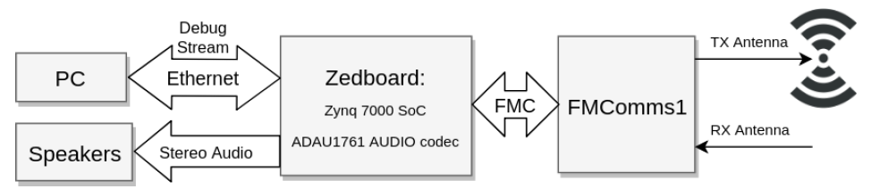
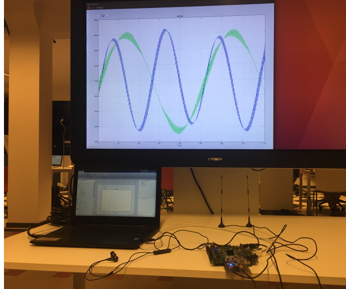
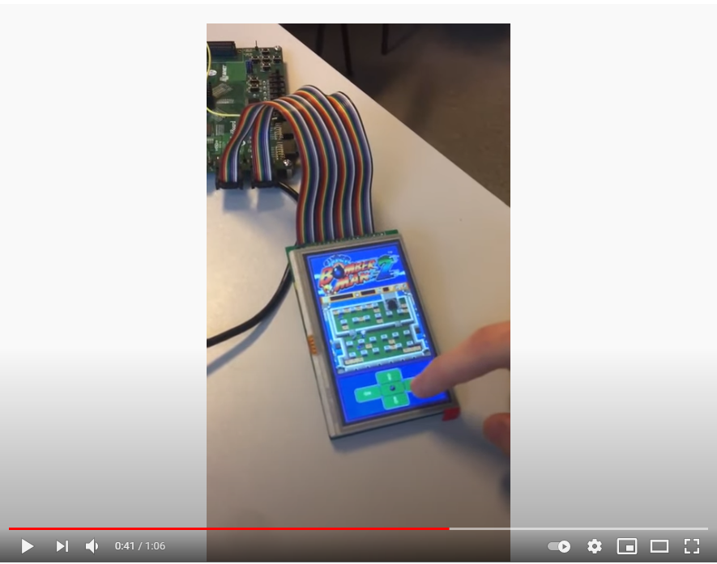
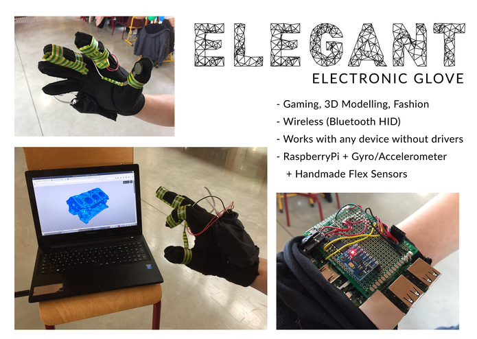

## University Projects

### Master Thesis - FPGA implementation of a QPSK transceiver
Digital radio for audio streaming on ZedBoard Zynq-7000 with AD-FMCOMMS1-EBZ evaluation board as analog front end. Built using System Generator for DSP in MATLAB Simulink. Explored digital modulation schemes, carrier recovery, System Generator hardware considerations, UI for streaming IQ data to MATLAB from ZedBoard and scrambling & descrambling.

### VHDL Bomberman Game

Full implementation of RGBHV, game logic, touchscreen controller and sprites in VHDL. Touchscreen SPI FSM implemented in [PicoBlaze](https://www.xilinx.com/products/intellectual-property/picoblaze.html) assembly. See the above video for a demo and the [GitHub repository](https://github.com/jsl2/bomberman/)
### Bachelor Thesis - Connected Health
- Raspberry Pi records data from connected **Bluetooth** sensors
- Patients are identified using an **RFID** scanner
- Measurements are stored in a no-SQL real-time **Firebase** database
- Health stats are displayed on a configurable dashboard, written in **Angular**

(click to see demo on YouTube)

Group project with Scrum. I was tasked with writing the bluetooth drivers to run  for the connected devices (blood pressure monitor and smart scales) in Python. Implementation of required parts of the Health Device Profie (HDP) from specifications, see the [GitHub repository](https://github.com/jsl2/ee5_release)

### Software Defined Radio
OFDM implementation on [NI USRP](https://www.ni.com/nl-be/shop/hardware/products/usrp-software-defined-radio-device.html) in LabVIEW
Developed Viterbi coder/decoder DLL for LabVIEW for final project.

### OFDM Audio Modem
Transmit bitmap image over acoustic channel with OFDM in MATLAB. See the [GitHub repository](https://github.com/jsl2/OFDM_modem)

### Encryption and decryption for realtime audio
Embedded systems project for encryption and decryption of streaming audio on Zybo Zynq-7000 SoC.
- Development of multiprecision arithmetic library in C
- ARM assembly optimizations for multiprecision arithmetic
- Implementation of Station-to-Station protocol for key agreement
- AES with Galios/Counter Mode (AES-GCM) for authenticated encryption

### Android App development
Android app for contact sharing with QR-codes. Project for OOP Java course. See the [GitHub repository](https://github.com/jsl2/ee5_release)

## Extra-Curricular Projects

### Hackathon News4future Winner
Developed a voice-controlled interface on top of the [twipe](https://www.twipemobile.com/comic-news-for-kids-and-new-speak-win-take-home-the-media-innovation-price/) API, finding and presenting news in a neat and accessible manner.

### HackBordeaux Winner
Built a wireless electronic glove used as a virtual mouse. Interact with 3D CAD objects, play shooters, etc.

My main task was making the Pi Zero emulate a Bluetooth HID mouse.
